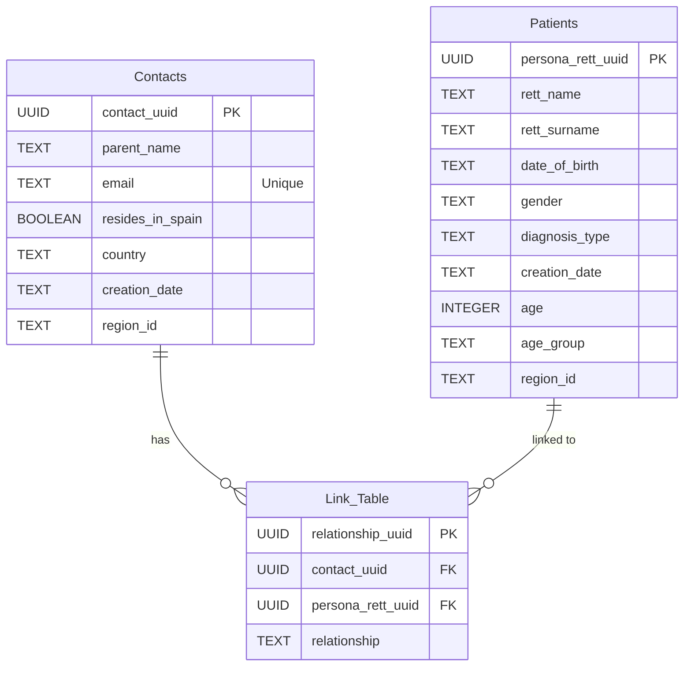
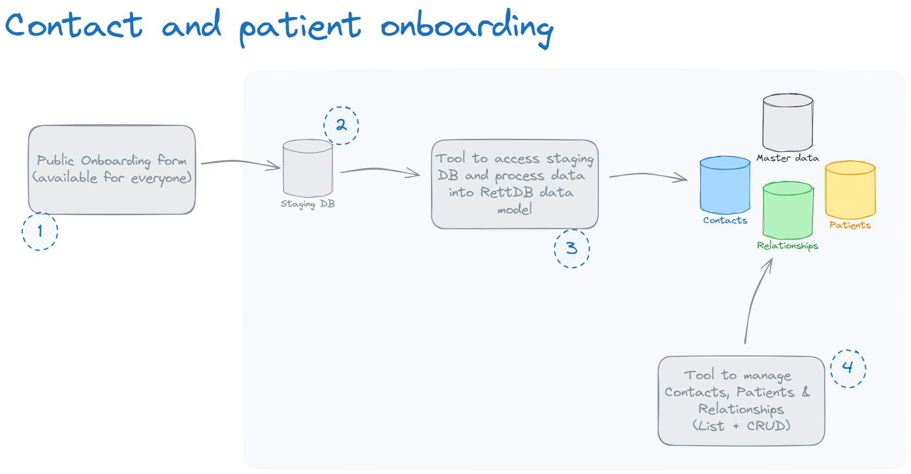
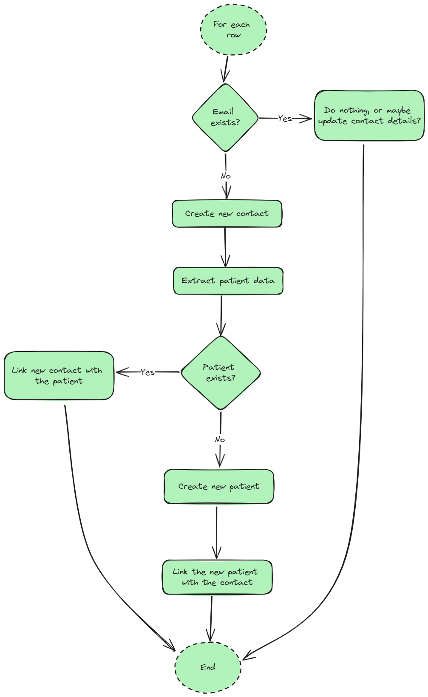

# Data integration flow

The objective is to move data from a staging CSV with this format (it could be a DB):

parent_name;email;relationship;resides_in_spain;country;rett_name;rett_surname;date_of_birth;gender;diagnosis_type;creation_date;age;age_group;region_id

To a data model with Contact/Patient/Relationship structure:



The objective is to simulate step 3 from this diagram:



The main logic is executed by manager.py:



# How to execute

For this to work, the first time you need to execute the script create_tables.py, to create an empty DB with the desired structure.

```bash
Python create_tables.py <name of your database>.db
```

Once the DB is created, you can execute the data integration script:

```bash
Python main_batch.py input.csv <name of your database>.db
```
